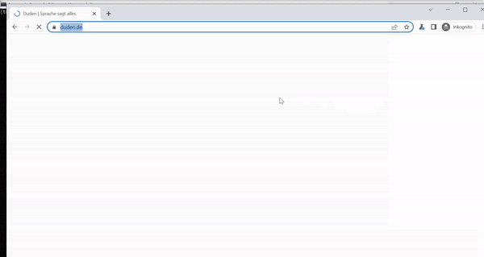
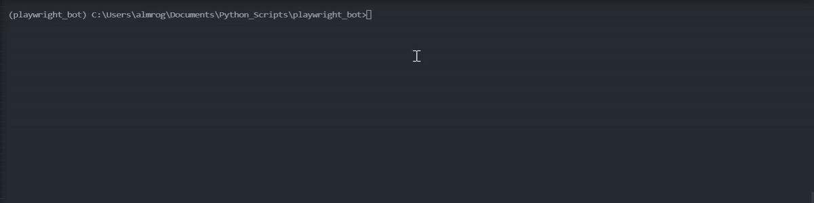

[](https://pypi.python.org/pypi/html2json/)
[](https://pypi.python.org/pypi/html2json/)
[](https://pypi.python.org/pypi/html2json/)

# duden_search

_Kleines Kommandozeilenprogramm zum Nachschlagen von Wörtern aus dem Duden-Wörterbuch._



## Ziele:

* Erkundung des Playwright-Tool mit seiner Python-API für Web-Browsing und Web-Scraping mit dem BeautifulSoup-Tool. 
* Erstellung einen Bot, der auf die Seite www.duden.de zugreift und in der Lage ist, die Informationen zu einem vom Autor angegebenen Wort herunterzuladen und zu suchen und die Informationen als Rich Text im JSON-Format herunterzuladen.
* All dies sollte mit Code, der in Python geschrieben und für die Implementierung oder Erweiterung durch andere Programmierer dokumentiert ist. 

## Environment

Für die Reproduktion der Python-Umgebung, mit der ich dieses Tool ausgeführt habe, habe ich die Datei requirements.txt zur Verfügung gestellt, die von diesem Repository heruntergeladen werden kann. 
Es ist möglich, dass weniger Bibliotheken und "Dependencies" benötigt werden als in der requirements.txt beschrieben. Verwenden Sie pip oder conda, um die Abhängigkeiten zu finden, die Sie für diese Aufgabe benötigen.
Nachfolgend finden Sie eine Liste der Bibliotheken für die Anwendung main.py sowohl von der Standard-Python-Bibliothek als auch von Drittanbieter-Bibliotheken. 

* Playwright https://playwright.dev/
* Beautiful soup https://www.crummy.com/software/BeautifulSoup/bs4/doc/
* Pytest https://docs.pytest.org/en/7.1.x/
* Request  https://docs.python-requests.org/en/latest/

## Usage
Die nächste Codezeile dient zum Nachschlagen des Wortes "Wort" im Duden und zum Speichern der Definitionen im CSV-Format und der HTML-Seite im JSON-Format. 
Die Animation zeigt, wie man die Hilfe abfragt, um die vom CLI benötigten Parameter zu sehen, sowie ein Beispiel für die erwartete Ausgabe für das Wort "Bagger". 
```
>python main.py -h -iw Wort -oj Wort.json -oc Wort.csv
```


## Test-Politik

Pytest wird als Paket zum Testen verwendet. Einige Eckfälle wurden nicht bewertet, insbesondere bei der Verwendung des Playwright-Selektors für einige Tags im Html-Dokument sowie für den Html-zu-Json-Parser. 
Um die Tests auszuführen, geben Sie einfach in die Befehlskonsole ```pytest``` ein. Fügen Sie das Flag -v hinzu, um mehr Details über fehlgeschlagene Fälle zu erhalten.

## Enwickler
Roger Almengor González 
* [CV](https://www.linkedin.com/in/roger-almengor-6b6904217/)
* [Pages](https://rogeralmengor.github.io/)